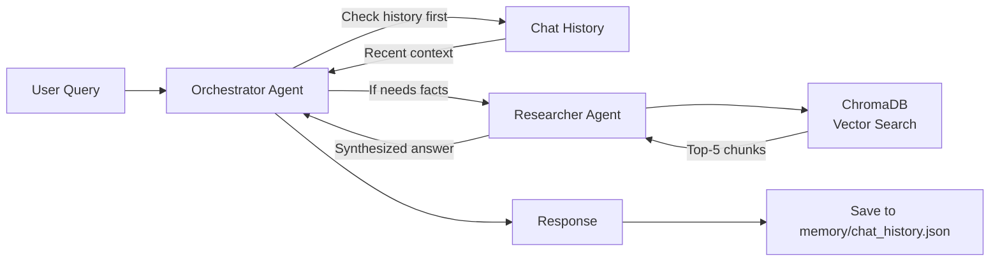

# Second Brain

> A personal AI assistant powered by RAG and multi-agent architecture that remembers your notes and conversations.

Second Brain is an intelligent chatbot that acts as your personal knowledge companion. It ingests your documents and notes into a vector database, allowing you to query them conversationally. Unlike typical RAG systems, it uses a multi-agent architecture that intelligently decides whether to search your knowledge base or recall information from your conversation history, creating a truly persistent memory experience.

## Features

- **Multi-Agent RAG Architecture** - Orchestrator agent delegates to a researcher agent for document search, optimizing when to use retrieval vs. conversation memory
- **Persistent Conversational Memory** - Chat history survives across sessions, stored as JSON-serialized message history
- **Incremental Knowledge Base Updates** - Add or modify documents without clearing the database; uses smart delete-then-add pattern
- **Automated Evaluations** - Built-in test suite with LLM-as-judge and custom evaluators for both retrieval accuracy and memory persistence
- **Full Observability** - OpenTelemetry integration with Arize Phoenix for real-time trace visualization and performance monitoring
- **Local Embeddings** - Uses Sentence Transformers for on-device vectorization with no API costs
- **Visual Web UI** - Chainlit-based interface showing multi-agent coordination and thinking steps in real-time

## Tech Stack

### Core
- **Python 3.13+** with `uv` package manager
- **Pydantic AI** - Type-safe agent framework with tool integration
- **Anthropic Claude Sonnet 4** - Primary LLM for both agents

### RAG Pipeline
- **ChromaDB** - Persistent vector database with HNSW indexing
- **Sentence Transformers** - Local embedding model (`all-MiniLM-L6-v2`, 384-dim vectors)

### Observability
- **OpenTelemetry SDK** - Distributed tracing instrumentation
- **Arize Phoenix** - Local trace visualization and LLM observability platform
- **OpenInference** - LLM-specific span enrichment

### Testing
- **Pydantic Evals** - Evaluation framework with LLM-as-judge and custom evaluators

### Interface
- **Chainlit** - Web-based chat UI with step visualization for multi-agent coordination

## Architecture

Second Brain uses a **two-agent system** for intelligent query routing:



**Key Components:**

- **Orchestrator Agent** - Main interface that decides whether to answer from conversation history or delegate to the researcher
- **Researcher Agent** - Specialized agent that performs vector similarity search (top-5 retrieval) and synthesizes answers from retrieved chunks
- **Persistent Memory** - JSON-serialized Pydantic AI message history that persists across sessions
- **Incremental Ingestion** - Delete-then-add pattern allows updating files in `/data` without clearing the entire database

**Data Flow:**
1. User asks a question
2. Orchestrator checks conversation history for context
3. If external knowledge is needed, orchestrator delegates to researcher
4. Researcher queries ChromaDB vector store (top-5 similarity search)
5. Response is synthesized and saved to persistent memory

## Quick Start

### Prerequisites

- Python 3.13 or higher
- `uv` package manager ([install guide](https://github.com/astral-sh/uv))
- Anthropic API key

### Installation

1. Clone the repository:
```bash
git clone <repository-url>
cd second-brain
```

2. Install dependencies:
```bash
uv sync
```

3. Set up your environment variables:
```bash
# Create .env file
echo "ANTHROPIC_API_KEY=your-key-here" > .env
```

### Setup

1. Add your documents to the `data/` folder (supports `.txt` and `.md` files):
```bash
# Example: Add personal notes
echo "# About Me\n\nI love building AI systems..." > data/about-me.md
```

2. Ingest your knowledge base:
```bash
uv run python src/ingest.py
```

3. Start chatting:
```bash
uv run python main.py
```

## Usage

### Interactive Chat

Start a conversation with your second brain:

```bash
uv run python main.py
```

**Commands:**
- Type your questions naturally
- `clear` - Reset conversation memory
- `exit` - Quit the application

The chatbot maintains persistent memory across sessions. Your chat history is saved to `memory/chat_history.json`.

### Web UI

Launch the Chainlit web interface for a visual demo experience:

```bash
uv run chainlit run chainlit_app.py -w
```

Then visit `http://localhost:8000` to interact with your second brain through a visual interface that shows:
- **Multi-Agent Coordination** - See when the orchestrator delegates to the researcher agent in real-time
- **Agent Thinking Steps** - Collapsible steps showing the decision-making process
- **Persistent Memory** - Visual indication of when answers come from conversation history vs. knowledge base search
- **Knowledge Base Info** - See which files are loaded in your knowledge base

Perfect for demonstrations and understanding how the multi-agent system works under the hood!

### Knowledge Base Ingestion

Add or update documents in your knowledge base:

```bash
uv run python src/ingest.py
```

The ingestion script supports **incremental updates** - you can add or modify files in `/data` and re-run the script without deleting the `/db` folder. It automatically replaces old chunks with new ones using a delete-then-add pattern.

**Supported formats:** `.txt`, `.md`

### Evaluations

Run the automated test suite to validate retrieval accuracy and memory persistence:

```bash
uv run python -m src.eval
```

The evaluation suite includes:
- **RAG Retrieval Tests** - 9 test cases validating document search and answer quality using LLM-as-judge
- **Memory Persistence Tests** - 3 multi-turn conversation tests ensuring the orchestrator uses chat history correctly

### Telemetry Dashboard

Launch the Arize Phoenix observability dashboard:

```bash
uvx arize-phoenix serve
```

Then visit `http://localhost:6006` to view:
- Real-time trace visualization
- Agent execution flows
- Token usage and latency metrics
- Tool call patterns

## Development Progress

Project roadmap and completed milestones:

+ [x] Ingest Contacts
  + [x] Prep. the contacts
+ [x] Remember the history (persistent memory)
+ [x] Test drive the RAG
+ [x] Try ClaudeAI
+ [x] Evaluations
  + [x] Basic Evaluations
  + [x] Test if can remember the history (if chat history persisted)
+ [x] Incremental Notes
+ [x] Add an UI
+ [x] Telemetry
  + [x] PoC
  + [x] Trace Status: UNSET, `add_span_processor` order
+ [x] ~~Q: When I add new content in the `/data`, should I delete the files in `/db` folder and re-ingest the knowledge base?~~ Obsolete
+ [x] Inflate README.md, remember to include the tech stack
+ [ ] Make a video to showcase it
+ [ ] Blog

## How It Works

### RAG Pipeline

1. **Document Ingestion** - Files in `/data` are split into chunks (by double newline), embedded locally using Sentence Transformers, and stored in ChromaDB
2. **Vector Search** - User queries are embedded and matched against the database using cosine similarity
3. **Context Retrieval** - Top-5 most relevant chunks are retrieved
4. **Answer Generation** - Claude Sonnet synthesizes the final answer from retrieved context

### Memory System

- Chat history is serialized using Pydantic's `TypeAdapter` for robust message handling
- Stored as JSON in `memory/chat_history.json`
- Loaded on startup and passed to the orchestrator agent
- Enables multi-turn conversations where the agent remembers previous context

### Multi-Agent Coordination

The orchestrator is explicitly instructed to:
1. Check conversation history first for answers about user preferences or recent discussion
2. Only delegate to the researcher tool when external document search is needed
3. Avoid unnecessary tool calls for conversational questions

This creates a natural flow where the agent "remembers" what you've told it while still being able to search your knowledge base when needed.

## License

Mozilla Public License 2.0
